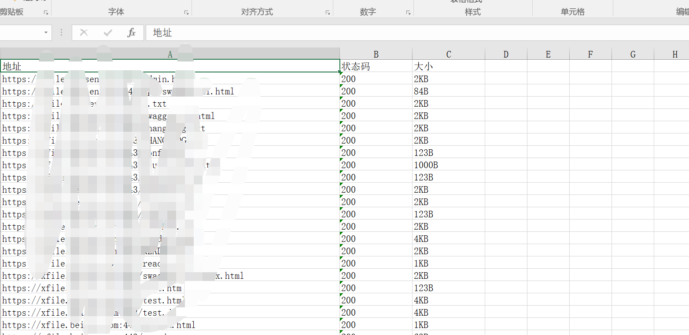
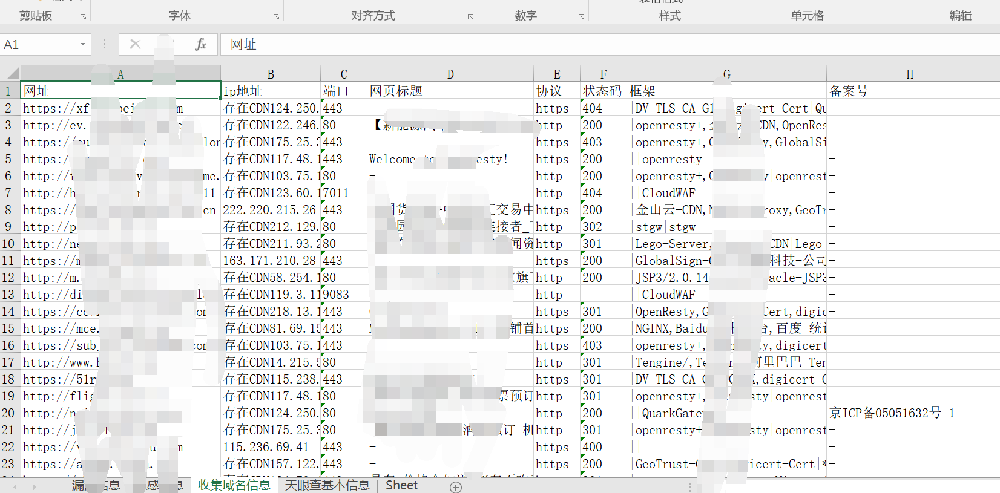

# laoyue

一款自动化监控收集资产的工具,可以帮助你定期收获资产,敏感信息和漏洞信息。


# 使用参数

* -c : 调用某眼查接口进行公司资产收集。

* -l :  对多个公司目标进行批量收集。 

* -o: 设置占用率(默认为100)

* -d: 扫描自己收集的域名列表

* -z: 设置为1,不走某眼查接口,直接利用某fa,某图查询

* -n: 设置值为1,扫描漏洞

* -m: 设置值为1,扫描目录

  
  
  

# 快速开始

1.在config.ini中填入自己的各种key,包括某查的cookie,某fa的key,某图的key,钉钉的key(可以搞多个账号白嫖每天的500积分)


2.安装程序所需要的库

3.如果服务器上没有nslookup记得装一个,用来判断cdn用的

`yum -y install bind-utils`

4.三种使用场景需要的命令

```python
 python3 laoyue.py  -c "公司名" -m 1 -n 1 -o 50 #使用于对单个公司及其之下的公司进行定期资产,敏感目录,漏洞扫描
```

```python
 python3 laoyue.py  -d "SRC.txt" -m 1 -n 1 -z 1 #对自己收集的域名进行定期资产,敏感目录,漏洞扫描
```

```python
 python3 laoyue.py  -c "公司名" -d "SRC.txt" -m 1 -n 1  #对某查收集的域名信息和自己收集的域名进行定期资产,敏感目录,漏洞扫描
```


# 脚本运行展示


1.钉钉的信息

新增暴露面资产如图


敏感信息如图


漏洞信息

这个因为之前写代码忘记写发送了后面补上

2.服务器目录下生成文件信息

1.一个总的excel






2.单独想看某项的话也可以在单个目录里去看


